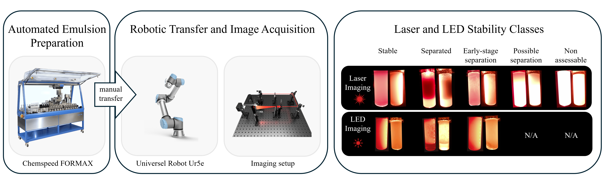

# PolyChar

Official codebase for "Computer Vision for Emulsion Characterisation using Laser and LED"

This repository contains the code used for image-based emulsion stability classification. The workflow combines automated emulsion preparation, robotic image acquisition, and deep learning models to classify visual emulsion stability states from vial images.
Emulsion samples were prepared using a Chemspeed-assisted workflow and imaged using a robotic imaging platform. Two illumination modes were used: laser imaging and LED imaging. The laser image dataset was treated as a 5-class classification problem, while the LED image dataset was treated as a 3-class classification problem.


## Method



    1. Automated emulsion preparation
    Emulsion formulations were prepared using a Chemspeed FORMAX-assisted workflow. The formulation space included different oil phases, aqueous phases, salts, and surfactants.

    2. Robotic image acquisition  
    Prepared samples were transferred into 8 mL vials and imaged using a robotic platform. Images were collected using both laser and LED illumination.

    3. CNN-based stability classification
    Convolutional neural network models were trained to classify visual emulsion stability states. Separate models were trained for laser and LED datasets.


## Installation

To install the repository, follow these steps (Note that this will install the CPU version of torch only):

1. **Clone the repository**:
    ```sh
    git clone https://github.com/sduynk/Emulsion-Stability-Characterisation.git

    cd Emulsion-Stability-Characterisation
    ```

2. **Create a conda environment and ensure it is activated**:
    ```sh
    conda create --name emulsion_env python=3.9
    conda activate emulsion_env
    ```

3. **Install the required dependencies**:
    ```sh
    pip install -r requirements.txt
    ```

4. **Verify the installation**:
    ```sh
    python -m unittest discover
    ```

If you want to install torch with CUDA for GPU acceleration, afterwards you can do the following.

5. **Uninstall torch and torchvision from the environment**
    ```
    pip uninstall torch torchvision
    ```

6. **Install torch and torchvision with CUDA support e.g. `cu121` (see notes for CUDA version):**

    ```sh
    pip install torch==2.3.0+cu121 torchvision==0.18.0+cu121 --extra-index-url https://download.pytorch.org/whl/cu121
    ```


> **Note:**  
> - The CUDA version (e.g. `cu121`) should match your GPU and driver.  
> - For most users, you do **not** need to install the CUDA toolkit separately.
> - If you have a different GPU or CUDA version, see [PyTorch's official installation guide](https://pytorch.org/get-started/locally/).
> - While efforts have been made towards bit-accurate reproducibility, differences in drivers and cuda toolkits, among other factors, will likely yield slightly different results.

## Datasets

The necessary datasets to run the code are hosted at https://zenodo.org/records/21040022. Replace the empty folders for...
- `Emulsion_Stability_3class-data`
- `Emulsion_Stability_5class-data`

With the corresponding folders in Zenodo and you should be good to go!


## Stability Results


Running `stability.py` on the emulsion with 5 class dataset (laser) should give the following **(or similar)** results.

| Model           |F1 Score    | Accuracy   | Precision   | Recall     |
|--------------   |----------- |--------    |----------   |----------  |
| EfficientNet B0 | 0.75±0.07  | 0.83±0.04  | 0.75±0.07   | 0.80±0.06  |
| Resnet18        | 0.75±0.07  | 0.81±0.06  | 0.75±0.08   | 0.78±0.05  |
| ConvNext Tiny   | 0.74±0.07  | 0.82±0.05  | 0.75±0.07   | 0.76±0.06  |

Running `stability.py` on the emulsion with 3 class dataset (LED) should give the following **(or similar)** results.

| Model           |F1 Score    | Accuracy   | Precision   | Recall     |
|--------------   |----------- |--------    |----------   |----------  |
| EfficientNet B0 | 0.86±0.03  | 0.91±0.02  | 0.85±0.04   | 0.88±0.04  |
| Resnet18        | 0.85±0.04  | 0.91±0.03  | 0.86±0.05   | 0.86±0.04  |
| ConvNext Tiny   | 0.82±0.05  | 0.89±0.04  | 0.81±0.06   | 0.84±0.04  |


## Project Structure

The project is organized as follows:

```
Emulsion-Stability-Characterisation/
├── Emulsion Stability with LED - 3 Class/
│   ├── 3_class-Data/
│   │   └── annotations.csv
│   ├── 3_class-Results/
│   │   ├── convnext_final_confusion_matrix_LED4.csv
│   │   ├── convnext_results_LED4.csv
│   │   ├── efficientnet_final_confusion_matrix_LED4.csv
│   │   ├── efficientnet_results_LED4.csv
│   │   ├── resnet18_final_confusion_matrix_LED4.csv
│   │   └── resnet18_results_LED4.csv
│   ├── dataloaders.py
│   ├── models.py
│   ├── stability.py
│   ├── train.py
│   └── utils.py
├── Emulsion Stability with Laser - 5 Class/
│   ├── 3_class-Data/
│   │   └── annotations.csv
│   ├── 3_class-Results/
│   │   ├── convnext_final_confusion_matrix_LSR7.csv
│   │   ├── convnext_results_LSR7.csv
│   │   ├── efficientnet_final_confusion_matrix_LSR7.csv
│   │   ├── efficientnet_results_LSR7.csv
│   │   ├── resnet18_final_confusion_matrix_LSR7.csv
│   │   └── resnet18_results_LSR7.csv
│   ├── dataloaders.py
│   ├── models.py
│   ├── stability.py
│   ├── train.py
│   └── utils.py
├── .gitignore
├── LICENSE
├── emulsion.png
└── README.md
```

### Other Files
- **README.md**: This file, providing an overview of the project.
- **requirements.txt**: Lists the dependencies required to run the project.


## Authors
George Killick (george.killick@liverpool.ac.uk)
Seda Uyanik (seda.uyanik@liverpool.ac.uk)


## License
Distributed under the Unlicense License. See LICENSE.txt for more information.
